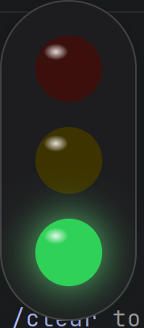
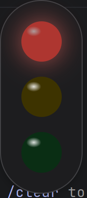
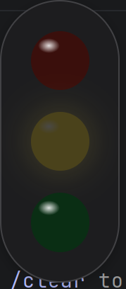
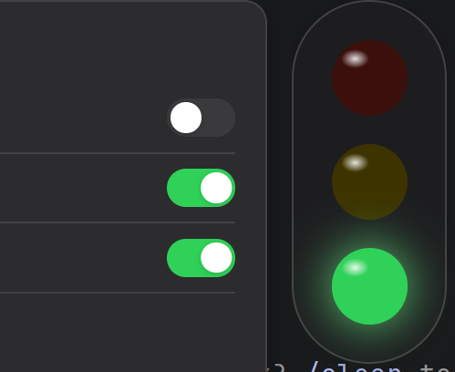
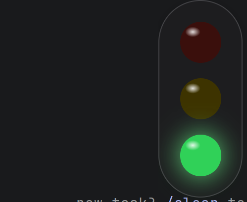
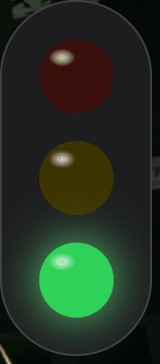

# AI Traffic Light

> **AI 状态红绿灯** — 桌面悬浮交通信号灯，实时显示 AI 助手运行状态

[](https://www.electronjs.org/)
[](LICENSE)
[]()

## 它是什么？

一个轻量级桌面悬浮工具，通过 **HTTP API** 接收状态指令，用红灯 / 黄灯 / 绿灯直观显示当前工作状态：

| 灯色 | 含义 | 动画效果 | 典型场景 |
|:----:|------|---------|---------|
| 🔴 **红灯** | THINKING — 思考中 | 呼吸渐变 | AI 正在生成代码、调用工具 |
| 🟡 **黄灯** | WAITING — 等待确认 | 闪烁提醒 | 需要用户做选择/确认 |
| 🟢 **绿灯** | DONE — 完成 | 常亮 | 一轮任务执行完毕 |

## 核心特性

- **Electron 桌面应用** — 完美 CSS 发光/动画效果，100% 还原原型设计
- **系统托盘图标** — 任务栏右下角显示红绿灯图标，方便判断是否运行
- **置顶透明悬浮窗** — 始终在最前，可拖拽到任意位置
- **呼吸 + 闪烁动画** — 红灯呼吸渐变，黄灯闪烁提醒
- **内置 HTTP API** — 供任何脚本/hook 调用切换状态
- **右键设置面板** — 单灯模式、深色/浅色模式、窗口置顶
- **单灯/三灯模式** — 切换只显示当前状态灯或三灯竖排

## 截图

### 三种状态

| 🟢 绿灯 · 完成 | 🔴 红灯 · 思考中 | 🟡 黄灯 · 等待确认 |
|:---:|:---:|:---:|
|  |  |  |

### 设置面板 & 关于

| 设置面板 | 关于窗口 |
|:---:|:---:|
|  |  |

### 动画演示



---

## 快速开始

### 1️⃣ 安装依赖

```bash
git clone https://github.com/singray/ai-traffic-light.git
cd ai-traffic-light/electron-app
npm install
```

### 2️⃣ 启动

```bash
# 深色主题（默认）
npm start

# 或指定参数
npx electron . --scale=2.5 --theme=dark --port=9527
```

启动后桌面右上角出现红绿灯，任务栏右下角出现托盘图标。

### 3️⃣ 验证 API

```bash
# 红灯（思考中）
curl -X POST http://localhost:9527/api/status \
  -H "Content-Type: application/json" \
  -d '{"color":"red"}'

# 黄灯（等待确认）
curl -X POST http://localhost:9527/api/status \
  -H "Content-Type: application/json" \
  -d '{"color":"yellow"}'

# 绿灯（完成）
curl -X POST http://localhost:9527/api/status \
  -H "Content-Type: application/json" \
  -d '{"color":"green"}'
```

---

## 🔗 与 Claude Code 集成（Windows 推荐方案）⭐

通过 hooks 把 Claude Code 的生命周期事件映射成灯色：

| 事件 | 颜色 | 含义 |
|---|:---:|---|
| `SessionStart` | 🟢 绿 | 刚启动 / 待命 |
| `UserPromptSubmit` | 🔴 红 | 开始处理你提的问题 |
| `PreToolUse` | 🔴 红 | 进行中（调用工具） |
| `PermissionRequest` | 🟡 黄闪 | 需要你做选择 |
| `Stop` | 🟢 绿 | 一轮回答完毕 |

**为什么要用助手脚本而不是直接在 hook 里写 curl？**

- Windows 下 inline 命令的引号转义极其痛苦
- 想做到 "启动时若服务未运行则自动拉起 / 已运行则跳过 / 失败不报错"，单条命令写不开
- 抽成 `tl.ps1` 后，5 个 hook 都只是一行调用，干净易维护

---

### 第 1 步：放置助手脚本

新建 `~/.claude/tl.ps1`（即 `C:\Users\<你>\.claude\tl.ps1`），内容如下：

```powershell
# Traffic Light helper for Claude Code hooks
# Usage:
#   tl.ps1 ensure                # 启动 electron 红绿灯（已存在则跳过），切绿灯
#   tl.ps1 red | yellow | green  # 切灯
#   tl.ps1 yellow blink          # 黄灯闪烁
# All errors are swallowed silently.

param(
    [string]$Color = "",
    [string]$Mode  = ""
)

$ErrorActionPreference = "SilentlyContinue"

# ⚠️ 改成你本地 traffic-light/electron-app 的绝对路径
$TL_APP_DIR = "C:\path\to\traffic-light\electron-app"
$TL_EXE     = Join-Path $TL_APP_DIR "node_modules\electron\dist\electron.exe"

function Test-TLPort {
    try {
        $c = New-Object System.Net.Sockets.TcpClient
        $c.Connect("127.0.0.1", 9527)
        $c.Close()
        return $true
    } catch {
        return $false
    }
}

function Set-TLColor([string]$col, [bool]$blink) {
    if ([string]::IsNullOrEmpty($col)) { return }
    if (-not (Test-TLPort)) { return }
    try {
        $body = @{ color = $col; blink = $blink } | ConvertTo-Json -Compress
        Invoke-RestMethod -Uri "http://127.0.0.1:9527/api/status" `
            -Method POST -ContentType "application/json" `
            -Body $body -TimeoutSec 2 | Out-Null
    } catch {}
}

try {
    if ($Color -eq "ensure") {
        if (-not (Test-TLPort)) {
            try {
                Start-Process `
                    -FilePath $TL_EXE `
                    -ArgumentList ".","--scale=2.5","--theme=dark","--port=9527" `
                    -WorkingDirectory $TL_APP_DIR
            } catch {}

            for ($i = 0; $i -lt 20; $i++) {
                Start-Sleep -Milliseconds 500
                if (Test-TLPort) { break }
            }
        }
        Set-TLColor "green" $false
        return
    }

    $blink = ($Mode -eq "blink")
    Set-TLColor $Color $blink
} catch {}
```

**只需要改一行**：把 `$TL_APP_DIR` 换成你本地 `electron-app` 的绝对路径。

### 第 2 步：在 settings.json 里挂 5 个 hooks

合并到 `~/.claude/settings.json` 的 `hooks` 字段下（已有 hooks 别覆盖，**追加**到对应事件数组里）：

```jsonc
{
  "hooks": {
    "SessionStart": [
      {
        "hooks": [{
          "async": true,
          "shell": "powershell",
          "type": "command",
          "command": "& \"C:\\Users\\<你>\\.claude\\tl.ps1\" ensure"
        }]
      }
    ],
    "UserPromptSubmit": [
      {
        "hooks": [{
          "async": true,
          "shell": "powershell",
          "type": "command",
          "command": "& \"C:\\Users\\<你>\\.claude\\tl.ps1\" red"
        }]
      }
    ],
    "PreToolUse": [
      {
        "matcher": "Bash|Write|Edit|Read|Glob|Grep|WebFetch|WebSearch|Task|Agent",
        "hooks": [{
          "async": true,
          "shell": "powershell",
          "type": "command",
          "command": "& \"C:\\Users\\<你>\\.claude\\tl.ps1\" red"
        }]
      }
    ],
    "PermissionRequest": [
      {
        "hooks": [{
          "async": true,
          "shell": "powershell",
          "type": "command",
          "command": "& \"C:\\Users\\<你>\\.claude\\tl.ps1\" yellow blink"
        }]
      }
    ],
    "Stop": [
      {
        "hooks": [{
          "async": true,
          "shell": "powershell",
          "type": "command",
          "command": "& \"C:\\Users\\<你>\\.claude\\tl.ps1\" green"
        }]
      }
    ]
  }
}
```

**关键点：**

- `async: true` —— hook 在后台跑，不阻塞 Claude Code 启动 / 提交
- `shell: "powershell"` —— 显式走 PowerShell，避免 Git Bash 上下文里语法被吃
- `& "<路径>"` —— PowerShell 调用运算符，路径含空格也安全

### 第 3 步：替换路径里的 `<你>`

把 5 处 `C:\\Users\\<你>\\.claude\\tl.ps1` 替换为你的真实用户名。注意 JSON 里反斜杠要写成 `\\`。

### 第 4 步：重启 Claude Code

新打开一个 Claude Code 会话，你应该看到：
1. 启动后 → 🟢 绿灯（待命）
2. 提交问题 → 🔴 红灯（处理中）
3. 弹权限确认 → 🟡 黄灯闪烁
4. 回答结束 → 🟢 绿灯

### 自检清单

如果灯不动：

- [ ] `~/.claude/tl.ps1` 里的 `$TL_APP_DIR` 路径正确？
- [ ] 单独跑 `powershell -File ~/.claude/tl.ps1 ensure` 能拉起红绿灯吗？
- [ ] `curl http://127.0.0.1:9527/api/health` 是否返回 `{"status":"running"}`？
- [ ] settings.json 里的 5 处 `<你>` 都替换了？
- [ ] settings.json 是合法 JSON？运行 `powershell -Command "Get-Content ~/.claude/settings.json -Raw | ConvertFrom-Json"` 不报错？

---

### 极简方案：直接 curl 调用

如果不需要"启动时自动拉起"，仅想切灯，可以跳过助手脚本，hook 里直接写 curl（macOS / Linux 适用）：

```bash
# 加入 ~/.bashrc 或 ~/.zshrc
alias tl='curl -s -X POST http://localhost:9527/api/status -H "Content-Type: application/json" -d'

tl '{"color":"red"}'      # 思考中
tl '{"color":"yellow","blink":true}'   # 等待确认
tl '{"color":"green"}'    # 完成
```

或 macOS / Linux 的 hooks 配置：

```jsonc
{
  "hooks": {
    "UserPromptSubmit": [{
      "hooks": [{
        "type": "command",
        "command": "curl -s -X POST http://localhost:9527/api/status -H 'Content-Type: application/json' -d '{\"color\":\"red\"}' >/dev/null 2>&1 || true"
      }]
    }],
    "Stop": [{
      "hooks": [{
        "type": "command",
        "command": "curl -s -X POST http://localhost:9527/api/status -H 'Content-Type: application/json' -d '{\"color\":\"green\"}' >/dev/null 2>&1 || true"
      }]
    }]
  }
}
```

---

## API 文档

| 方法 | 路径 | 说明 |
|:---:|------|------|
| `POST` | `/api/status` | 设置灯光颜色 |
| `GET` | `/api/status` | 获取当前状态 |
| `GET` | `/api/health` | 健康检查 |

### 设置灯光 `POST /api/status`

**请求：**
```json
{ "color": "red" }    // "red" | "yellow" | "green"
```

**响应：**
```json
{ "status": "ok", "color": "red", "text": "THINKING" }
```

---

## 操作说明

| 操作 | 功能 |
|:-----|------|
| **左键拖拽** | 移动红绿灯位置 |
| **右键** | 打开设置面板 |
| **左键点击其他地方** | 关闭设置面板 |
| **托盘图标单击** | 显示/隐藏红绿灯 |
| **托盘图标右键** | 切换灯色 / 退出 |
| `Escape` | 关闭设置面板 |

## 启动参数

| 参数 | 默认值 | 说明 |
|:-----|:------:|------|
| `--scale` | `2.5` | 灯泡缩放比例 |
| `--theme` | `dark` | 主题 (`dark` / `light`) |
| `--port` | `9527` | API 监听端口 |
| `--dev` | - | 打开 DevTools |

---

## 项目结构

```
ai-traffic-light/
├── electron-app/
│   ├── main.js          # 主进程（窗口 + 托盘 + HTTP API）
│   ├── preload.js       # IPC 桥接
│   ├── index.html       # 红绿灯 UI
│   ├── settings.html    # 设置面板 UI
│   ├── about.html       # 关于窗口
│   └── package.json
├── screenshots/         # 截图和演示 GIF
├── README.md
└── LICENSE
```

## 技术栈

| 层 | 技术 | 说明 |
|:--:|:----:|------|
| UI 渲染 | HTML + CSS | CSS box-shadow 发光 + @keyframes 动画 |
| 桌面框架 | Electron 28+ | 无边框透明悬浮窗 + 系统托盘 |
| HTTP API | Node.js `http` | 内置 API 服务 |
| 通信 | Electron IPC | 主进程 ↔ 渲染进程双向同步 |

## 兼容性

任何能发起 HTTP 请求的程序都可以驱动红绿灯：

| 工具 | 集成方式 |
|:-----|:--------|
| Claude Code | Hooks 配置自动调用 |
| Cursor | Cursor Rules / 自定义脚本 |
| Copilot | VS Code Task |
| Aider | `--message-callback` |
| CI/CD | pipeline 中 curl 调用 |
| 自定义 Agent | HTTP POST 到 localhost:9527 |

## License

MIT License — 随意使用、修改、分发。
